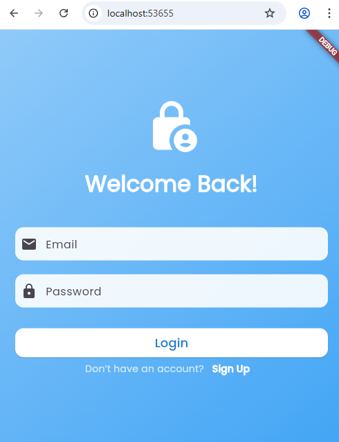
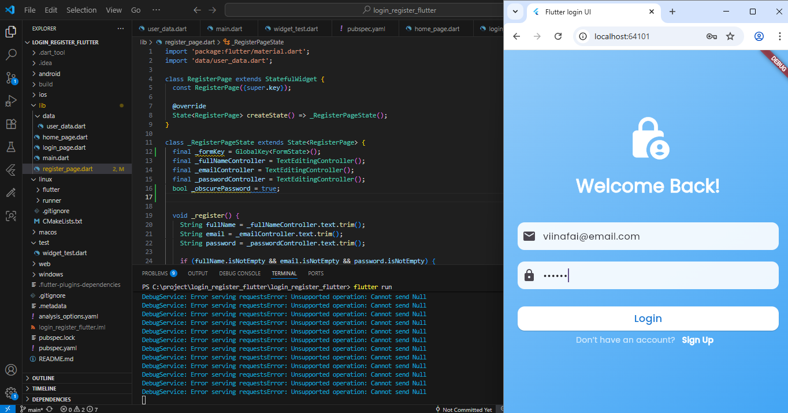
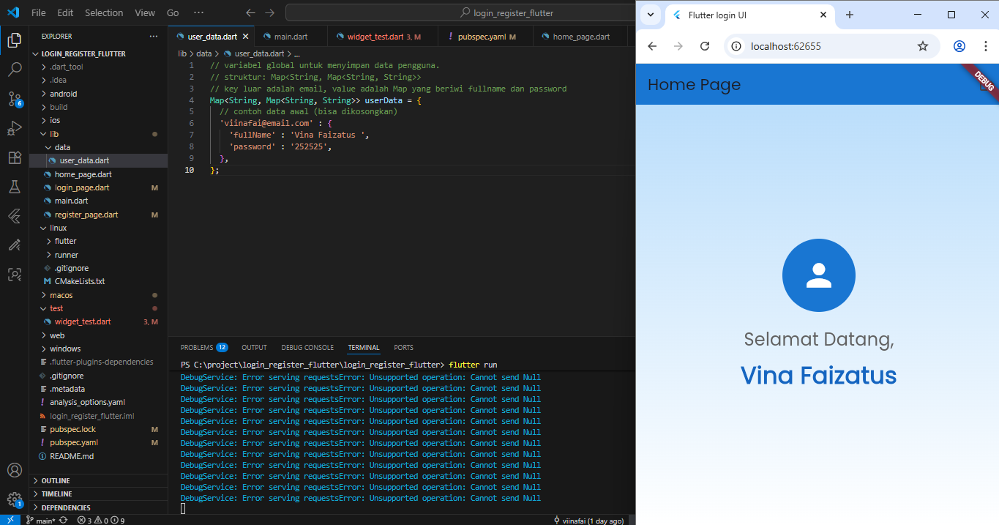
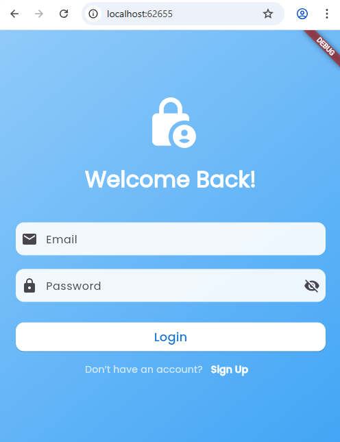
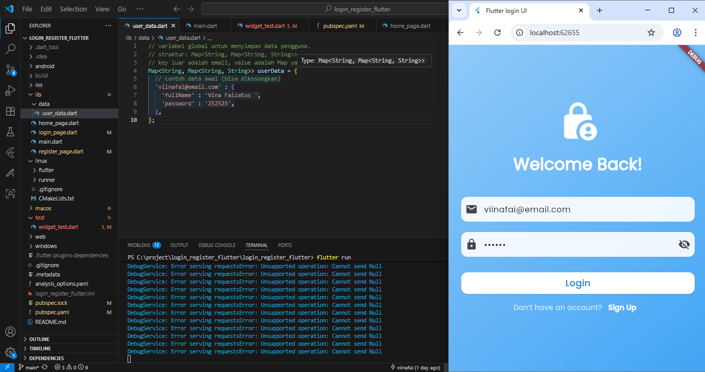
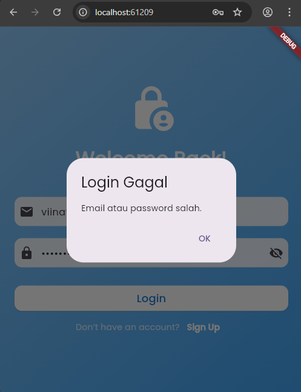
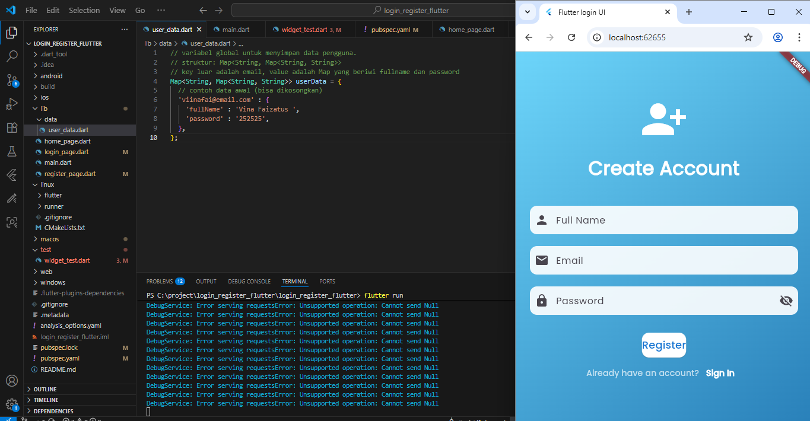
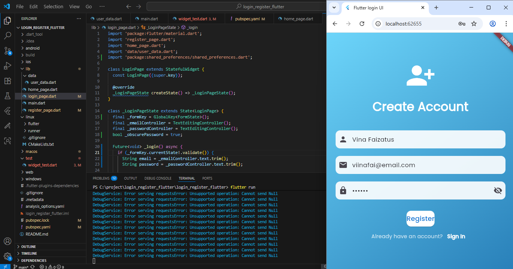
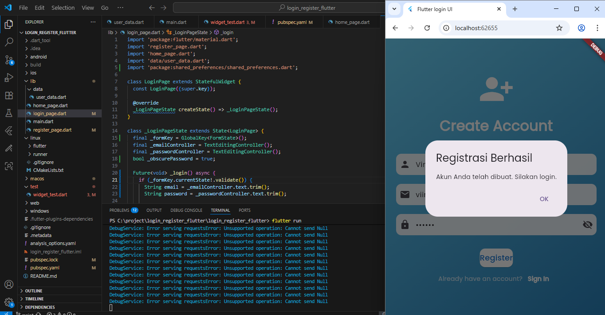

# login_register_flutter

A new Flutter project.

## Getting Started

Pendahuluan 
Selamat datang di modul praktikum Flutter! Modul ini akan memandu Anda langkah
demi langkah untuk membuat aplikasi sederhana dengan fungsionalitas Login dan Registrasi.
Kita akan fokus pada pembuatan antarmuka (UI) yang menarik, validasi input
pengguna, navigasi antar halaman, dan cara menyimpan data untuk sementara waktu di
dalam variabel.

- Wireframe Halaman Login
   1. Pada gambar berikut menampilkan halaman login. Pengguna perlu memasukkan Email, dan Password kemudian baru bisa login
    

    2. Pada langkah selanjutnya, pengguna perlu mengisi datanya, ingat! ini hanya bisa diakses ketika kita sudah mempunyai akun 
    

    3. halaman akan menampilkan "Selamat Datang, Vina Faizatus". (sebagai pengguna yang sudah daftar atau memiliki akun)
    

    4. kemudian tampilan yang kedua. sebenarnya sama dengan tampilan pertama, hanya saja disini saya menambahkan logo "Hide Password icon", guna dapat melihat password yang kita ketik/masukkan (untuk mengecek saja apakah password yg kita ketik sudah benar)
    

    5. pengguna memasukkan alamat email dan password, lalu klik login
    

    6. apabila password atau email yang dimasukkan oleh pengguna itu salah, maka akan muncul tampilan "Login Gagal". pengguna dapat mengecek lagi data yang dimasukkan itu salah atau benar
    

    -----------------------------------------------------

    - Wireframe Halaman Registrasi
    7. tampilan yang ketiga, yaitu Sign up atau membuat akun bisa juga disebut mendaftar akun. pada tampilan berikut pengguna diminta untuk memasukkan "Full Name", "Email", dan "Password" baru.
    

    8. pada tampilan berikut pengguna diminta untuk memasukkan "Full Name", "Email", dan "Password" baru. lalu klik Register
    

    9. halaman akan menampilkan Register Berhasil. artinya akun telah berhasil dibuat. kemudian pengguna dapat login pada halaman pertama. 
    

Dari praktikum pembuatan aplikasi Flutter dengan fitur login dan registrasi dapat disimpulkan bahwa aplikasi ini mampu menampilkan antarmuka sederhana namun fungsional untuk autentikasi pengguna. Proses login dan registrasi berjalan sesuai kebutuhan, dilengkapi dengan validasi input agar data yang dimasukkan benar. Fitur tambahan berupa ikon “Hide/Show Password” memudahkan pengguna untuk memverifikasi password yang diketik, sedangkan feedback berupa pesan “Login Gagal” maupun “Register Berhasil” memberikan kejelasan terhadap status proses yang dilakukan. Secara keseluruhan, praktikum ini berhasil memberikan pemahaman dasar mengenai penerapan autentikasi sederhana dalam pengembangan aplikasi mobile berbasis Flutter.
